## Object Detection Overview

I share my first project on github. I ran the object detection project using Darknet using custom trained weights for detecting plants and the results obtained are from the first trained weights. Although the training needs further improvements, the results obtained are substantial as they have a moderate level of accuracy in detection.    

## STEPS WHICH I DID FOR OBJECT DETECTION 

* Installed opencv and cuda drivers for faster performance
* Collected images and keep them in obj folder
* Generated annotations of the images
* Made changes to the yolov3 config file. During training of weights, I set the batch size to 64 and subdivisions to 32 (You can change this to 16,32,64 as per your PC configurations. If the PC shows the cuda out of error message when set to 16, try with higher values). Later, I updated the max_batches as per the formula 2000 multiplied by the number of classes. (This number should not be less than 4000). Finally, I changed the line steps to 80% and 90% of max_batches.
* In the config file, I made changes in the three yolo layers by setting the classes to 1 and by setting the filters before each yolo layer to 18. (using the formula of (classes + 5 ) multiplied by 3)
* In the config file, I set the random to zero.
* Created obj.names in the data folder and I wrote the class name which is "Plant".
* Created a list of the names of images in the train.txt file.
* I took pretrained convolutional weight files from yolov3 site and I put that file in the darknet folder.
* I did training of the data by typing the command darknet.exe detector train.data/obj.data cfg/yolov3-custom.cfg darknet.conv.74 on the the powershell prompt.
* I tested the images by typing the command darknet.exe detector test data/obj.data cfg/yolov3-custom.cfg backup/yolov3-custom_last.weights <image>.jpg
  
  ## LOSS CHART
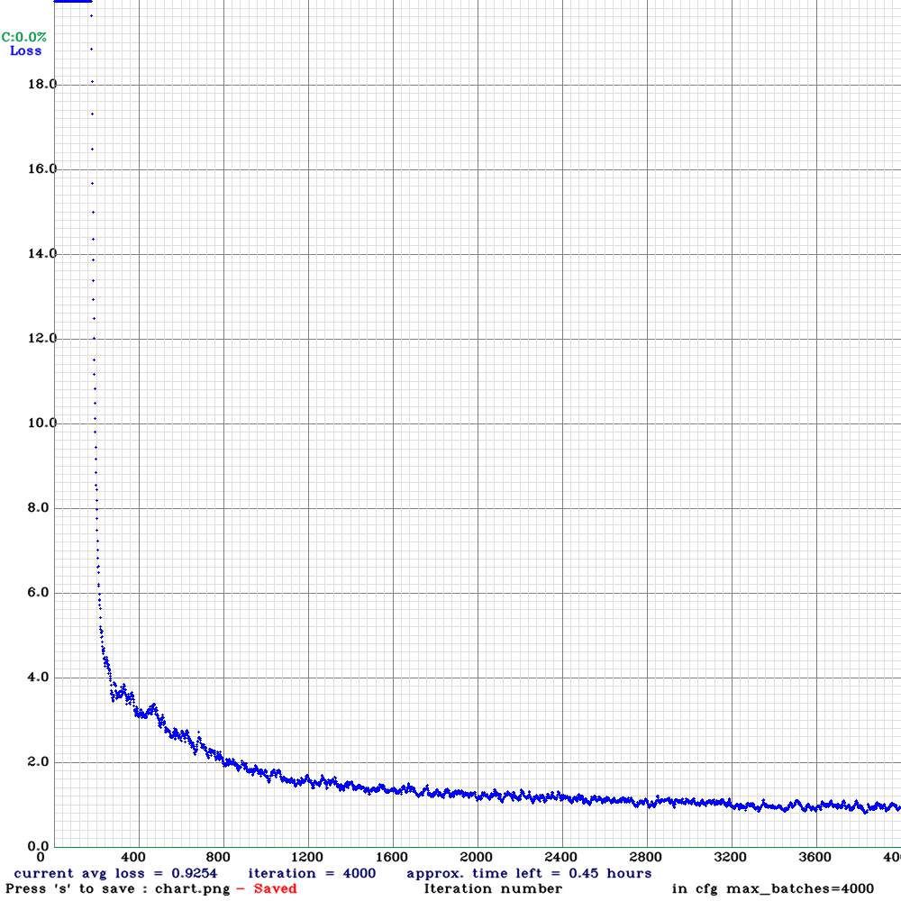  

  ## SOME IMAGES TESTED
  ### GOOD RESULTS
  
  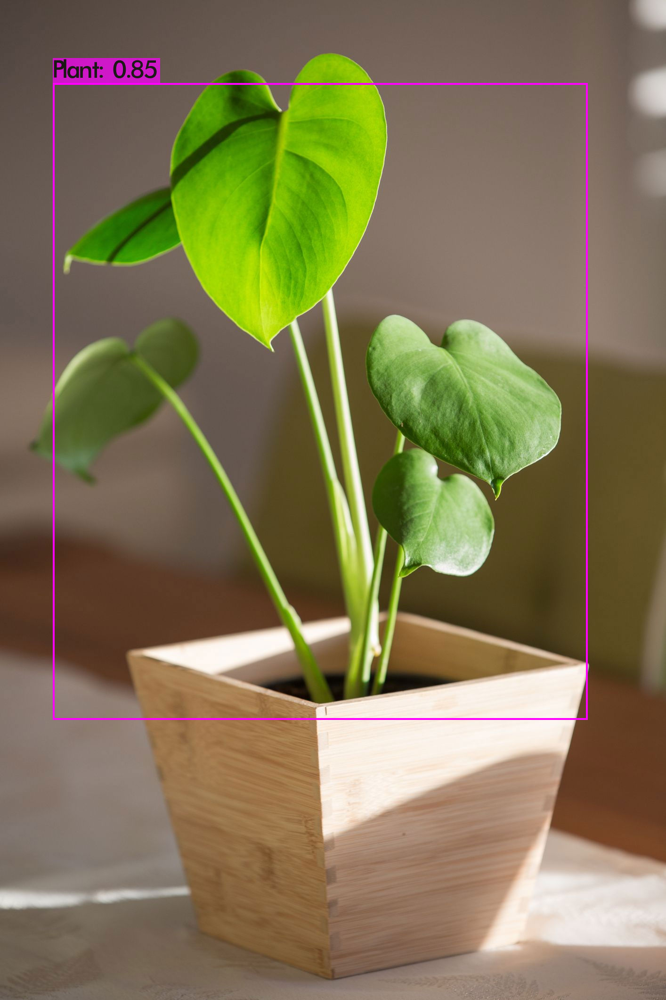  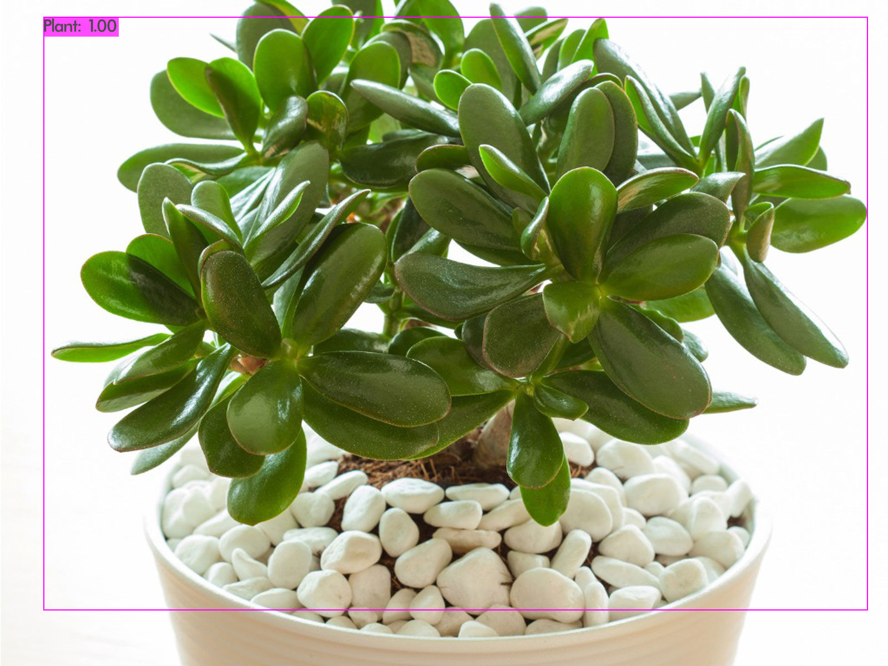  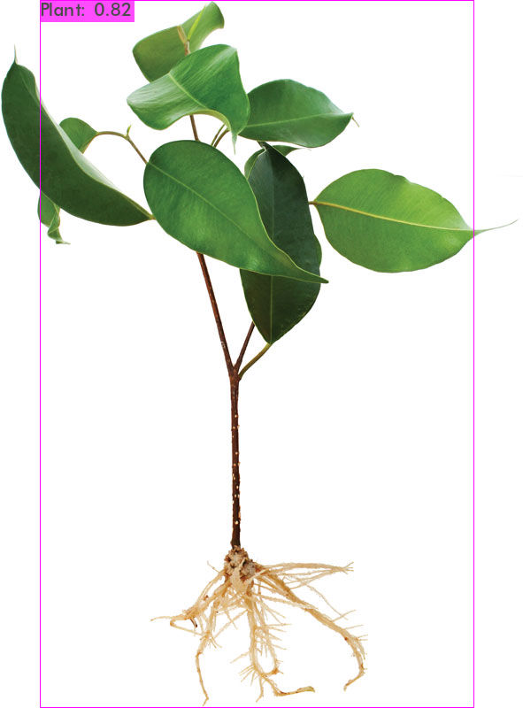  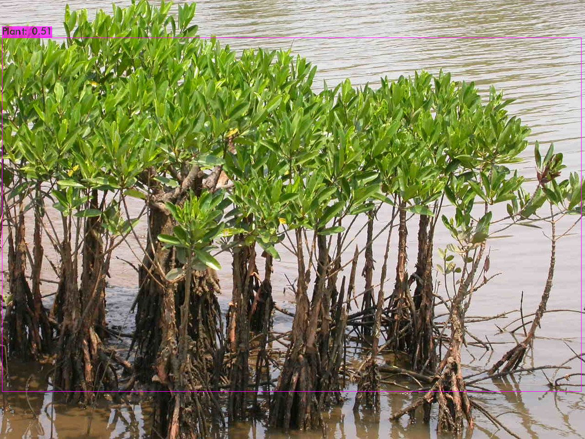  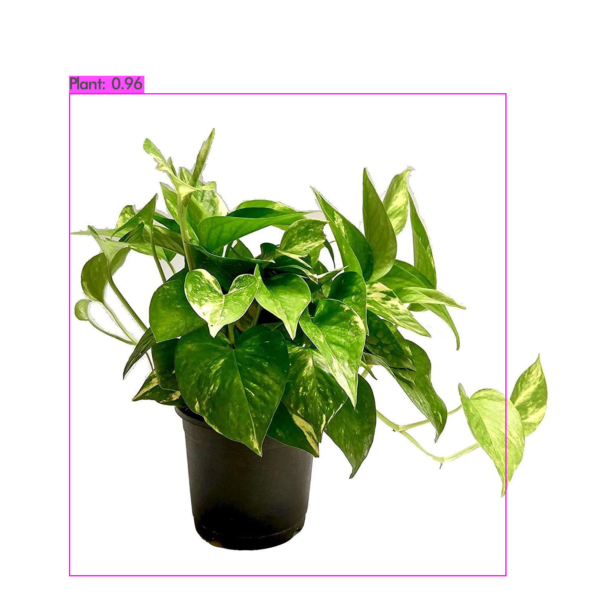  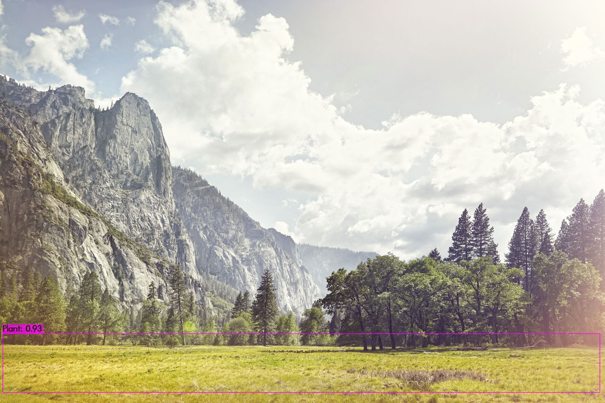  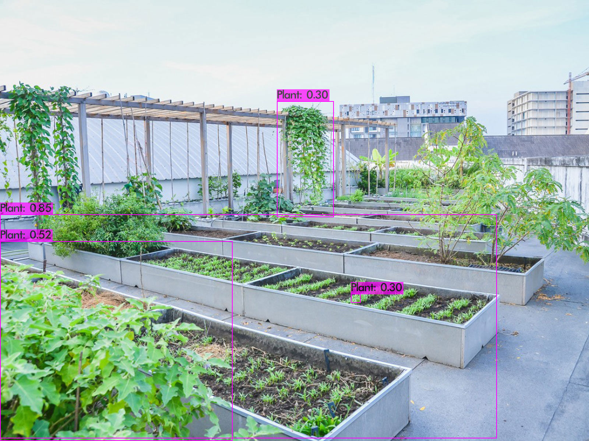  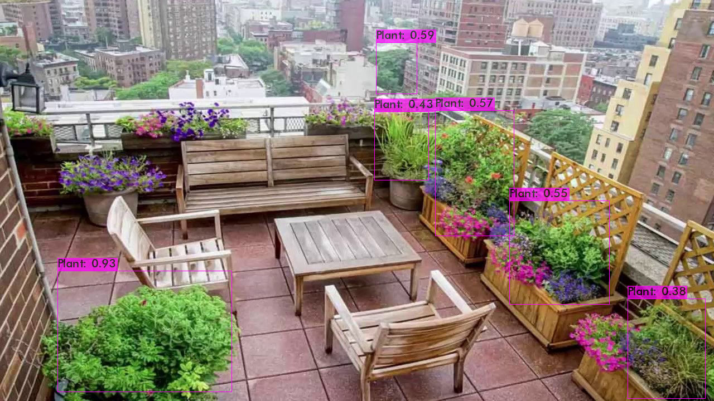  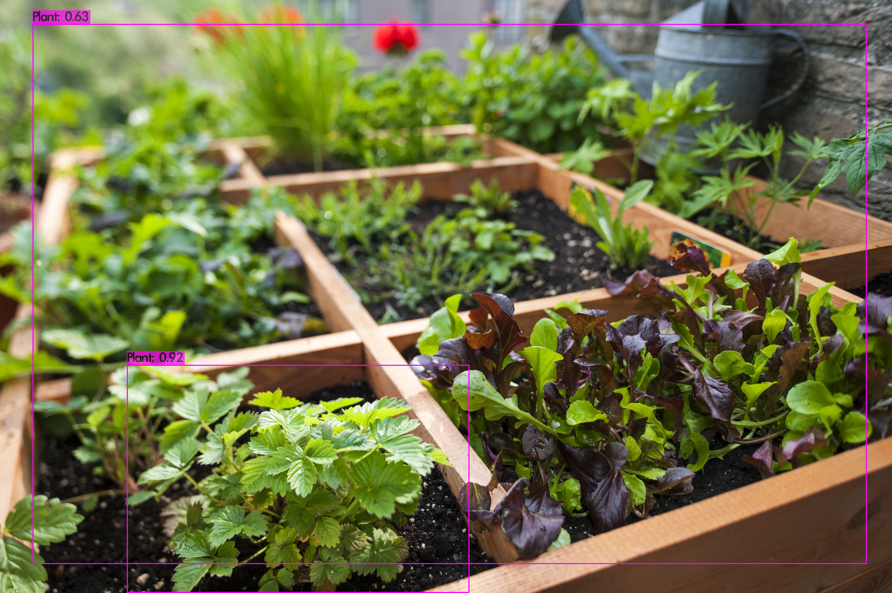    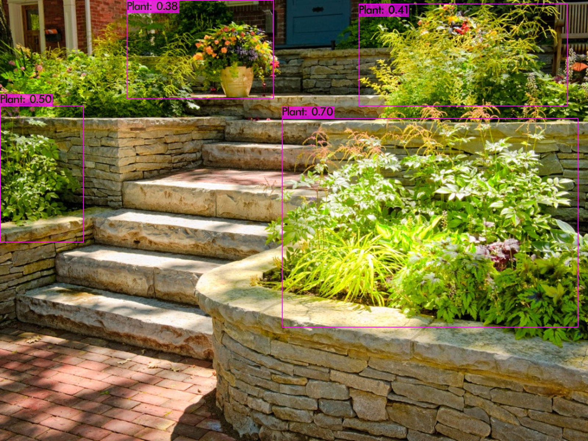
